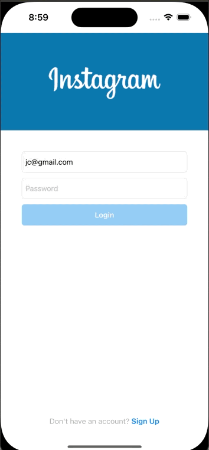
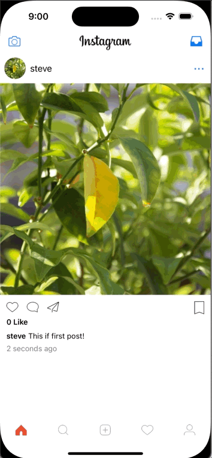
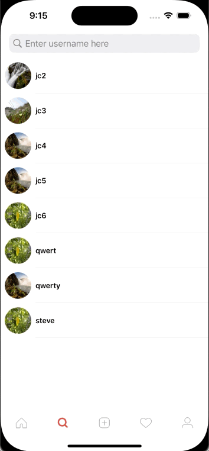
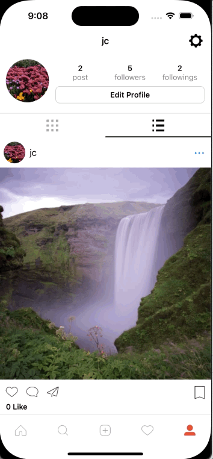

<h1>Introduction</h1>

An Instagram clone app made with swift uikit and postgresql for database

<h1>Demonstrate</h2>

<h2>Login & Register</h2>

 
<h2>Sharing Feed</h2>

 
<h2>Home Feed</h2>

 
<h2>Profile</h2>

 
<h2>Search</h2>

 
<h2>Sign Out</h2>

 
